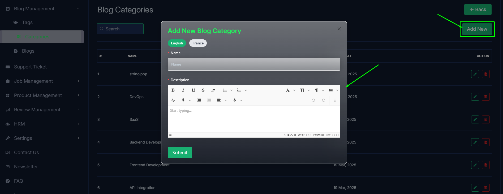

import React from 'react';
import Tabs from '@theme/Tabs';
import TabItem from '@theme/TabItem';

      <Tabs
        defaultValue="tags"
        values={[
          { label: 'Tags', value: 'tags' },
          { label: 'Category', value: 'category' },
          { label: 'Blogs', value: 'blog' },
        ]}
      >
<TabItem value="tags">

# Tags

- In this section, the admin can view the complete list of blog's tags.
- Admin can search a specific blog by using the **search bar**.
- Admin can delete the tag by using the **Delete** button.

- Admin can add a new tag by clicking the **Add New** button.
- A page will open where admin can add a new tag by fulfilling the form.

- Admin can edit a tag by clicking the **Edit** action button.
- A page will open where admin can edit the tag according to his requirement.

</TabItem>

<TabItem value="category">

# Category

- In this section, the admin can view the complete list of blog categories.
- Admin can search a specific blog by using the **search bar**.
- Admin can delete the category by using the **Delete** button.

- Admin can add a new category by clicking the **Add New** button.
- A page will open where admin can add a new category by fulfilling the form.

- Admin can edit a category by clicking the **Edit** action button.
- A page will open where admin can edit the category according to his requirement.

</TabItem>

<TabItem value="blog">

# Blogs

- In this section, the admin will be able to see all the existing blog and their key information.
- Admin can search a specific blog by using the **search bar**.
- Admin can delete the blog by using the **Delete** button.
- Admin can off/on the blog by using the **Status** switch. In which blogs are on, users can see them in the blog section. Otherwise not.

- Admin can add a new blog by clicking the **Add New** button.
- A page will open where admin can add a new blog by fulfilling the form.

- Admin can edit a blog by clicking the **Edit** action button.
- A page will open where admin can edit the blog according to his requirement.

- Admin can view the blog details by clicking the **View icon** button.

</TabItem>

</Tabs>