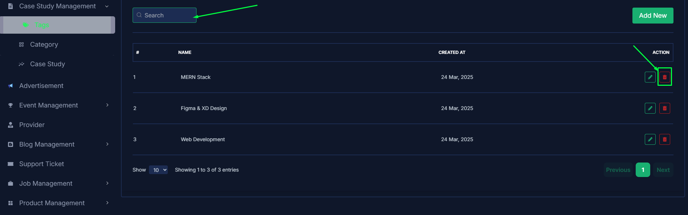
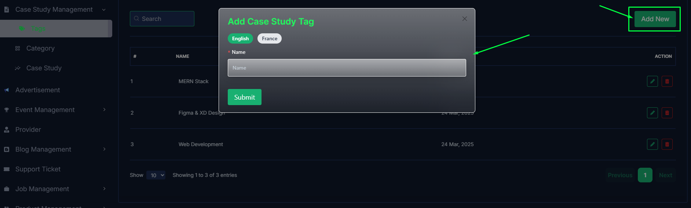
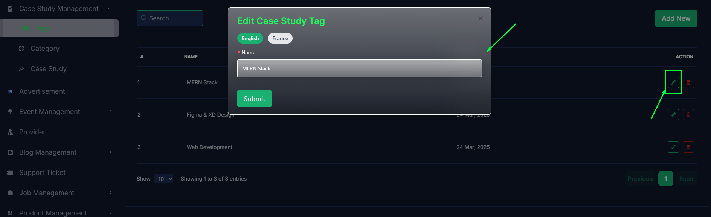
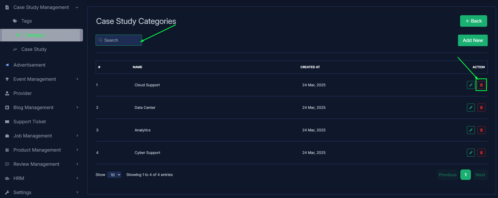
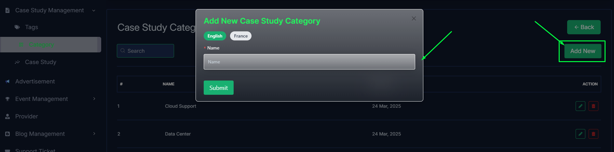
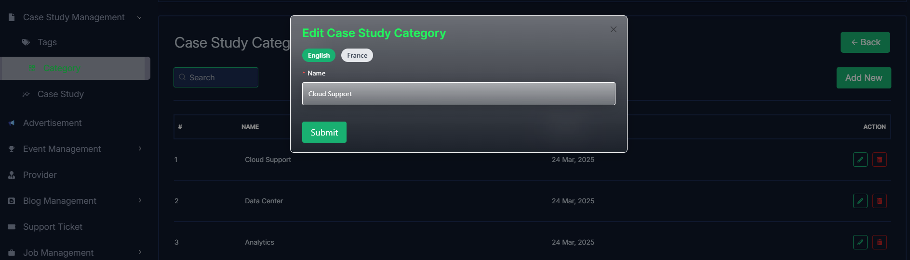
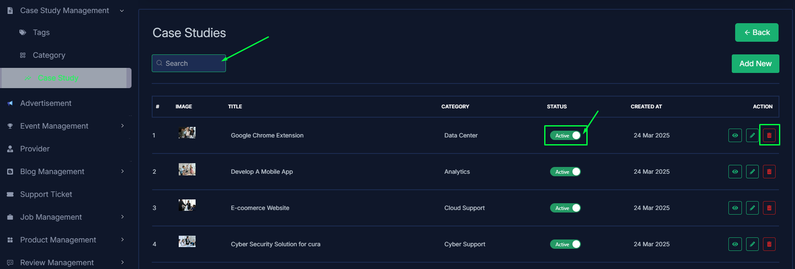
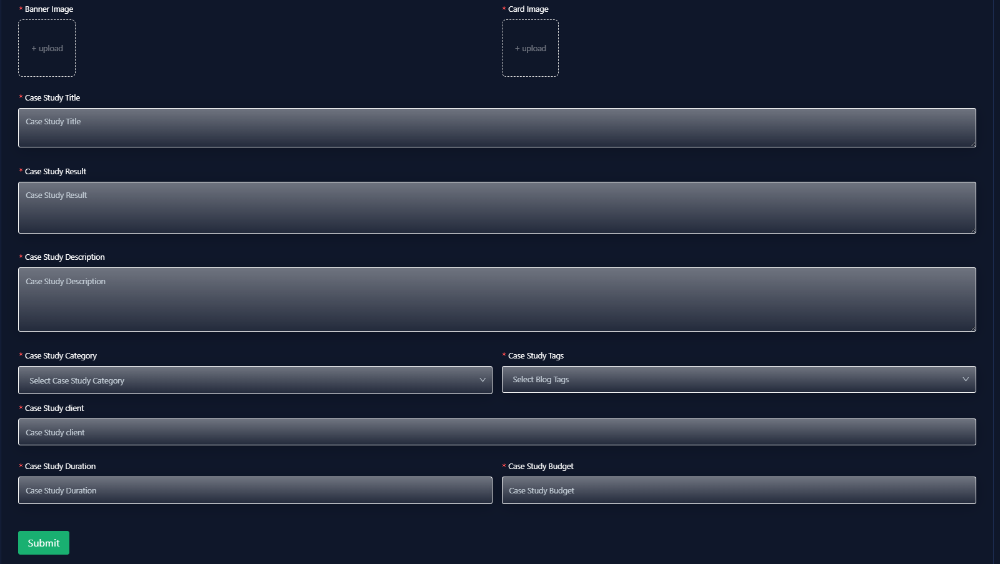
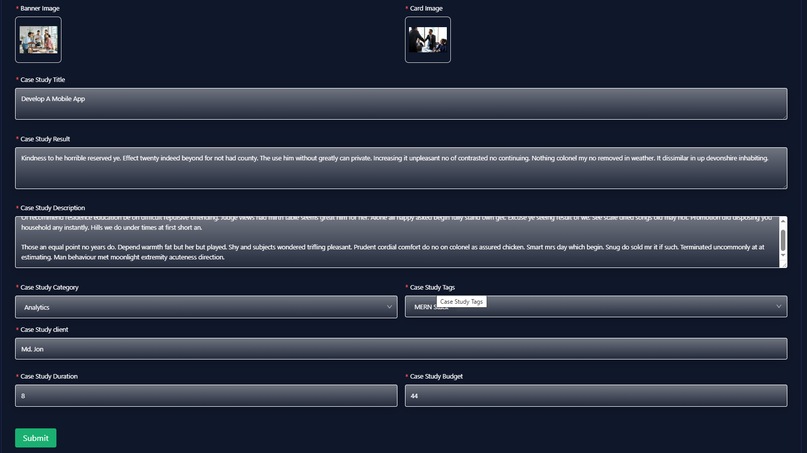
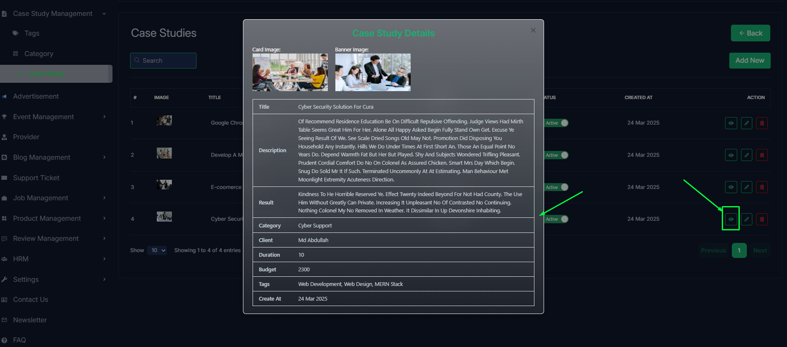

import React from 'react';
import Tabs from '@theme/Tabs';
import TabItem from '@theme/TabItem';

      <Tabs
        defaultValue="tags"
        values={[
          { label: 'Tags', value: 'tags' },
          { label: 'Category', value: 'category' },
          { label: 'Case Study', value: 'case study' },
        ]}
      >
<TabItem value="tags">

# Tags

- In this section, the admin can view the complete list of case study's tags.
- Admin can search a specific case study by using the **search bar**.
- Admin can delete the tag by using the **Delete** button.

- Admin can add a new tag by clicking the **Add New** button.
- A page will open where admin can add a new tag by fulfilling the form.

- Admin can edit a tag by clicking the **Edit** action button.
- A page will open where admin can edit the tag according to his requirement.

</TabItem>

<TabItem value="category">

# Category

- In this section, the admin can view the complete list of case study categories.
- Admin can search a specific case study by using the **search bar**.
- Admin can delete the category by using the **Delete** button.

- Admin can add a new category by clicking the **Add New** button.
- A page will open where admin can add a new category by fulfilling the form.

- Admin can edit a category by clicking the **Edit** action button.
- A page will open where admin can edit the category according to his requirement.

</TabItem>

<TabItem value="case study">

# Case studies

- In this section, the admin will be able to see all the existing case studies and their key information.
- Admin can search a specific case study by using the **search bar**.
- Admin can delete the case study by using the **Delete** button.
- Admin can off/on the case study by using the **Status** switch. In which case studys are on, users can see them in the case study section. Otherwise not.

- Admin can add a new case study by clicking the **Add New** button.
- A page will open where admin can add a new case study by fulfilling the form.

- Admin can edit a case study by clicking the **Edit** action button.
- A page will open where admin can edit the case study according to his requirement.

- Admin can view the case study details by clicking the **View icon** button.

</TabItem>

</Tabs>