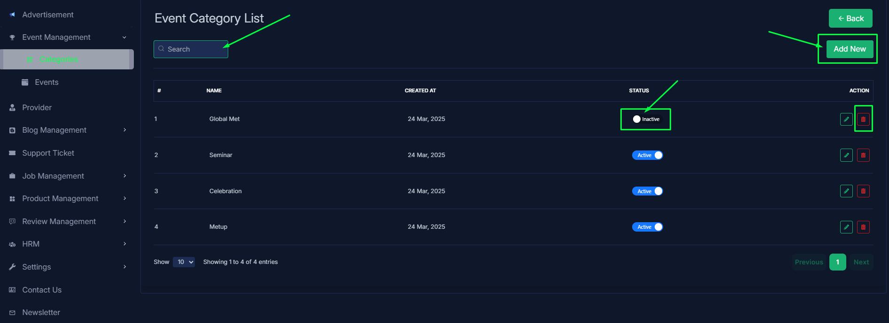
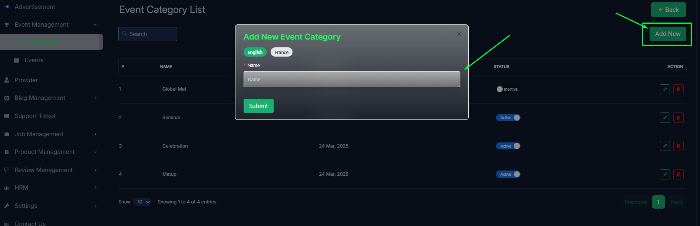
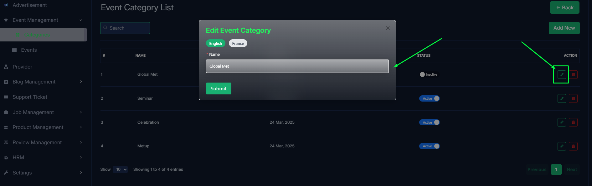
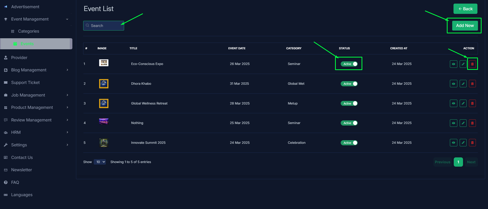
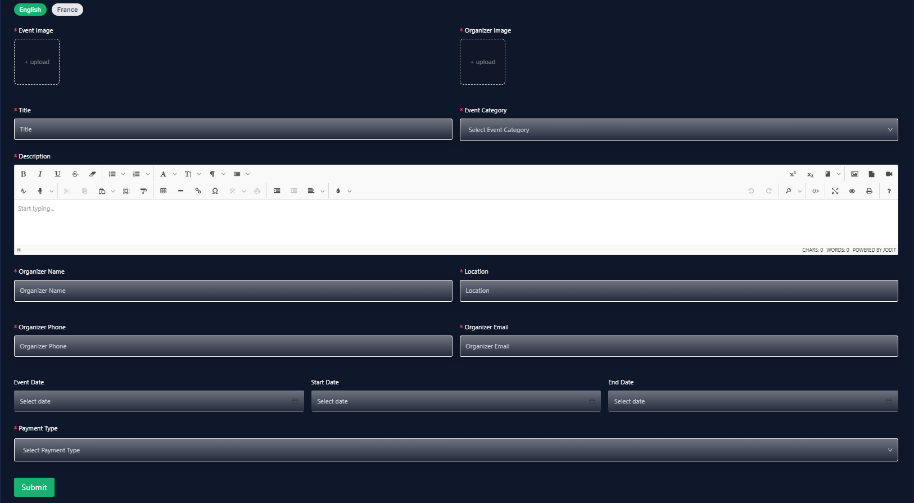
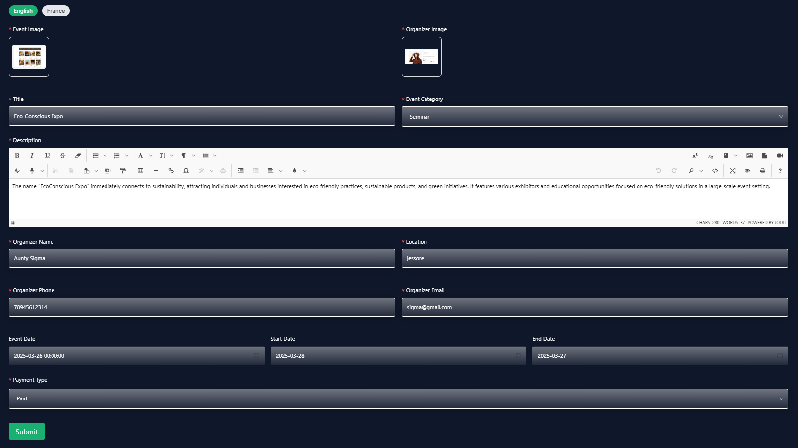
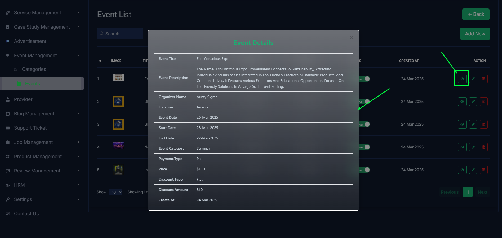

import React from 'react';
import Tabs from '@theme/Tabs';
import TabItem from '@theme/TabItem';

      <Tabs
        defaultValue="category"
        values={[
          { label: 'Category', value: 'category' },
          { label: 'Events', value: 'events' },
        ]}
      >

<TabItem value="category">

# Category

- In this section, the admin can view the complete list of event categories.
- Admin can search a specific category by using the **search bar**.
- Admin can delete the category by using the **Delete** button.
- Admin can off/on the category by using the **Status** switch. In which categories are on, users can see them in the category section. Otherwise not.

- Admin can add a new category by clicking the **Add New** button.
- A page will open where admin can add a new category by fulfilling the form.

- Admin can edit a category by clicking the **Edit** action button.
- A page will open where admin can edit the category according to his requirement.

</TabItem>

<TabItem value="events">

# Events

- In this section, the admin will be able to see all the existing events and their key information.
- Admin can search a specific event by using the **search bar**.
- Admin can delete the event by using the **Delete** button.
- Admin can off/on the event by using the **Status** switch. In which events are on, users can see them in the event section. Otherwise not.

- Admin can add a new event by clicking the **Add New** button.
- A page will open where admin can add a new event by fulfilling the form.

- Admin can edit a event by clicking the **Edit** action button.
- A page will open where admin can edit the event according to his requirement.

- Admin can view the event details by clicking the **View icon** button.

</TabItem>

</Tabs>