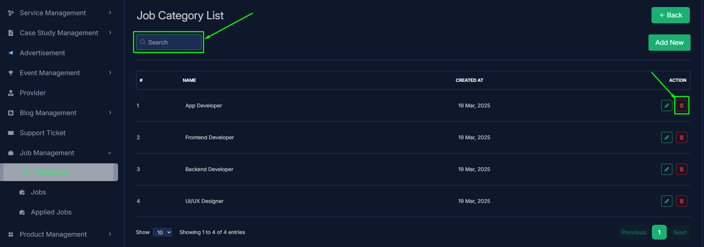
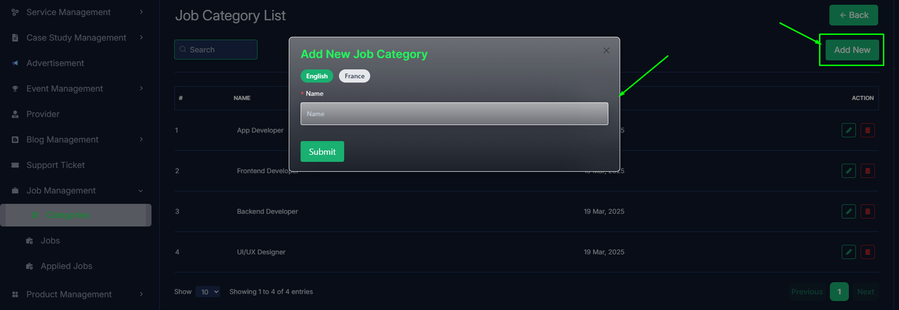
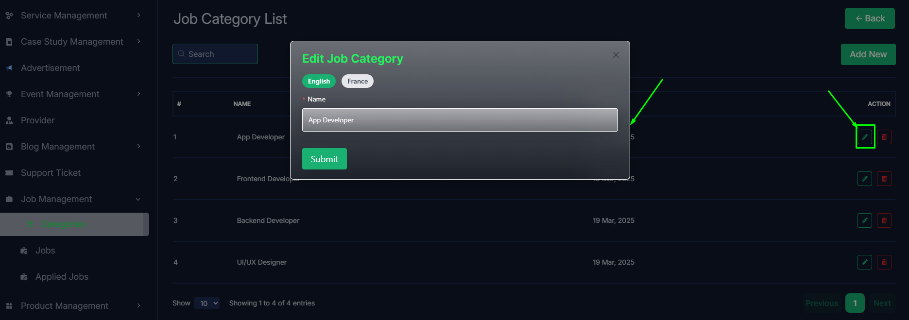
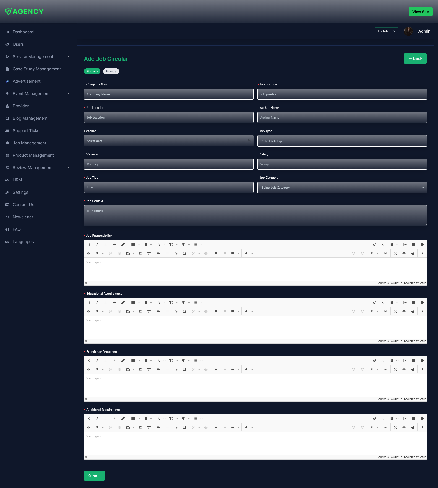
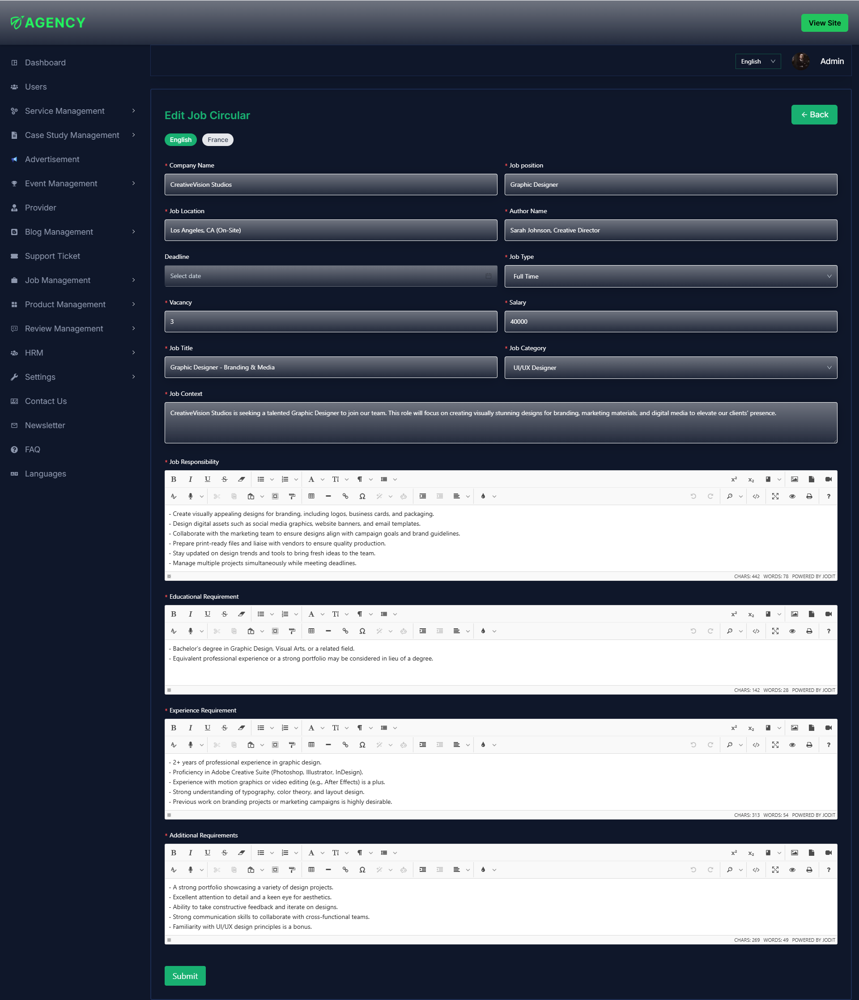
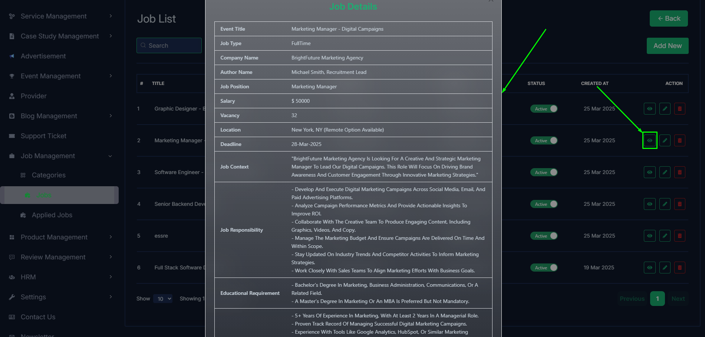
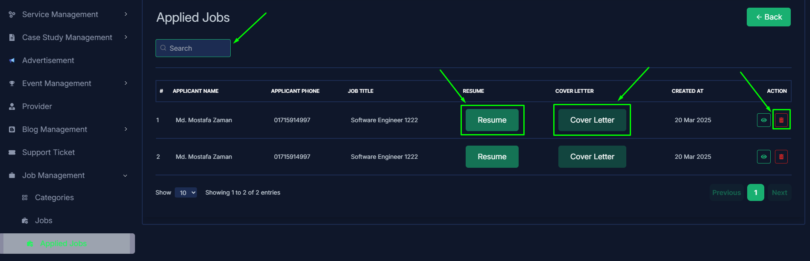
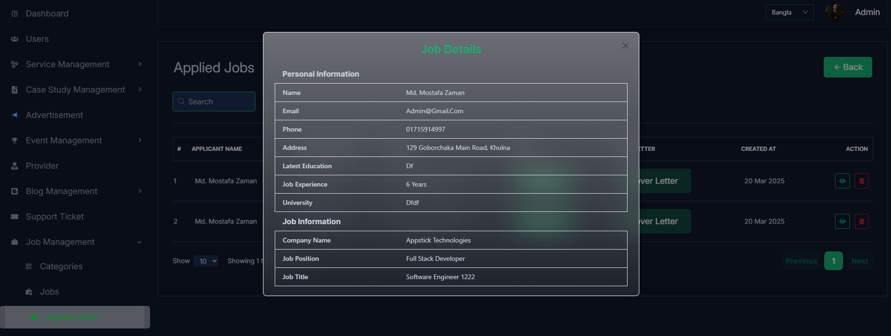

import React from 'react';
import Tabs from '@theme/Tabs';
import TabItem from '@theme/TabItem';

      <Tabs
        defaultValue="categories"
        values={[
          { label: 'Categories', value: 'categories' },
          { label: 'Jobs', value: 'jobs' },
          { label: 'Applied Jobs', value: 'applied jobs' },
        ]}
      >
<TabItem value="categories">

# categories

- In this section, the admin can view the complete list of job's categories.
- Admin can search a specific category by using the **search bar**.
- Admin can delete the category by using the **Delete** button.

- Admin can add a new job category by clicking the **Add New** button.
- A page will open where admin can add a new category by fulfilling the form.

- Admin can edit a category by clicking the **Edit** action button.
- A page will open where admin can edit the category according to his requirement.

</TabItem>

<TabItem value="jobs">

# Jobs

- In this section, the admin can view the complete list of job.
- Admin can search a specific job by using the **search bar**.
- Admin can delete the job by using the **Delete** button.
- Admin can off/on the job by using the **Status** switch. In which jobs are on, users can see them in the job section. Otherwise not.

- Admin can add a new job by clicking the **Add New** button.
- A page will open where admin can add a new job by fulfill all the requirements.

- Admin can edit a category by clicking the **Edit** action button.
- A page will open where admin can edit the category according to his requirement.

- Admin can view the job details by clicking the **View icon** button.

</TabItem>

<TabItem value="applied jobs">

# Applied jobs

- In this section, the admin will be able to see all the existing applied jobs and their key information.
- The admin can filter applied jobs by job title using the **search bar**.
- Admin can delete the applied job by using the **Delete** button.
- In this applied jobs list admin can view the resume and cover letter by clicking **Resume** and **Cover Letter** button who are applied for the job.
- And this cover letter and resume are downloaded as a pdf file.

- Admin can view the applied job details by clicking the **View icon** button.
- In where admin can view the details of the applicant details.

</TabItem>

</Tabs>