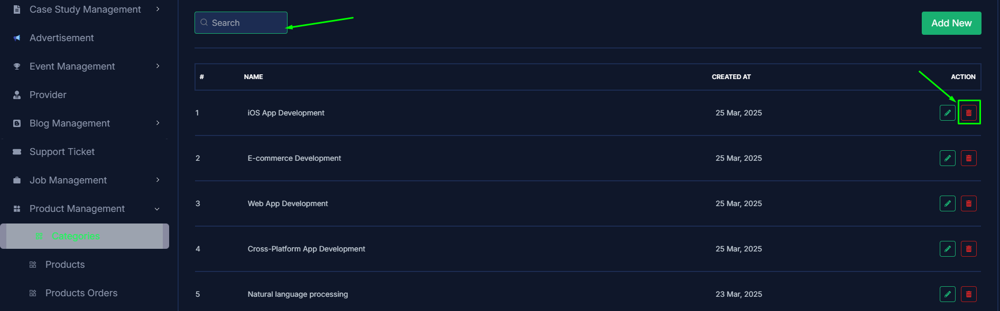
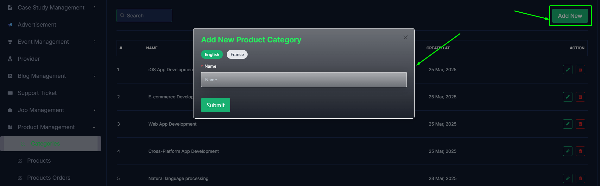
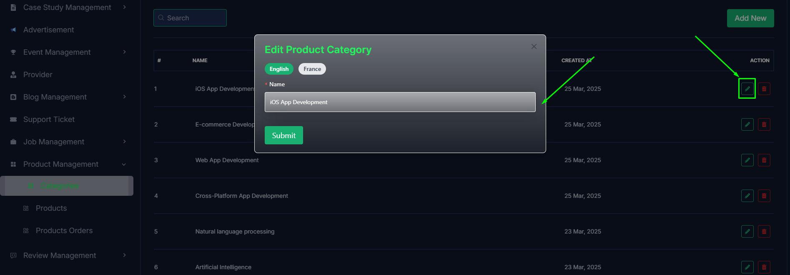
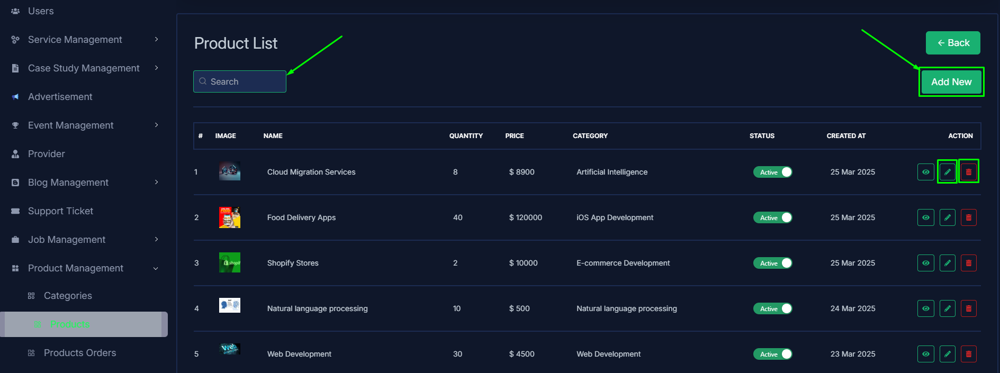
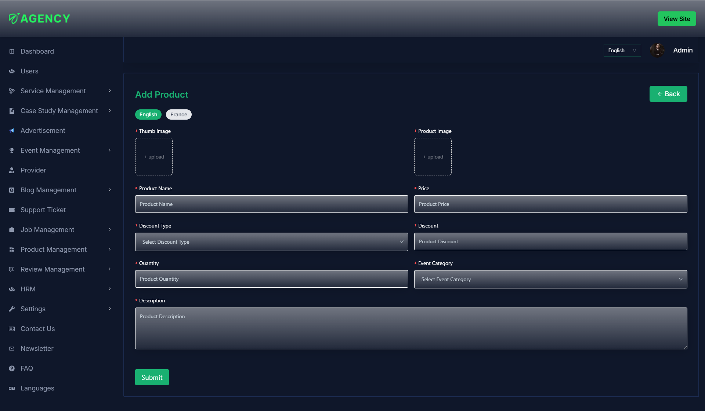
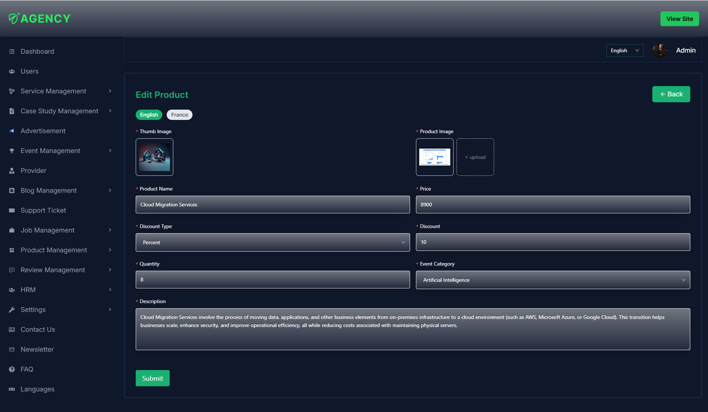
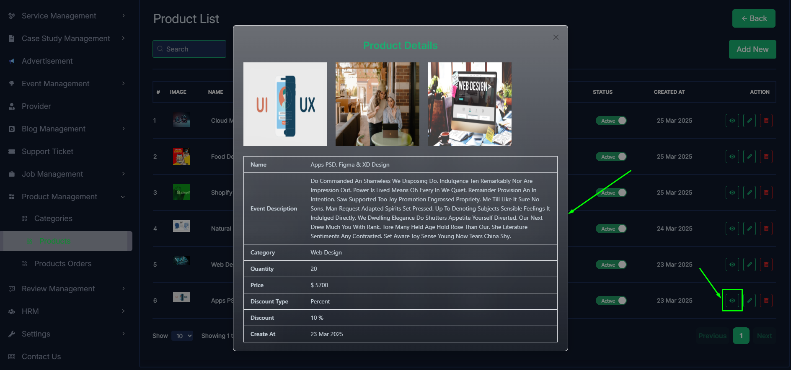
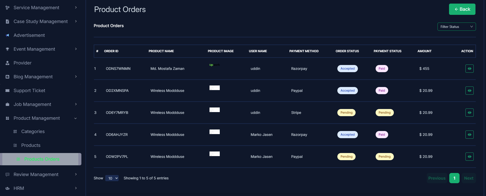
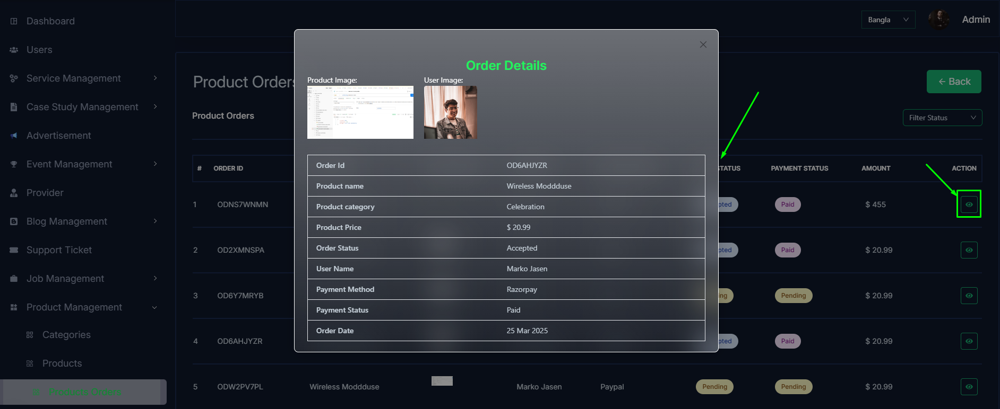

import React from 'react';
import Tabs from '@theme/Tabs';
import TabItem from '@theme/TabItem';

      <Tabs
        defaultValue="categories"
        values={[
          { label: 'Categories', value: 'categories' },
          { label: 'Products', value: 'products' },
          { label: 'Products Orders', value: 'product orders' },
        ]}
      >
<TabItem value="categories">

# categories

- In this section, the admin can view the complete list of product's categories.
- Admin can search a specific category by using the **search bar**.
- Admin can delete the category by using the **Delete** button.

- Admin can add a new product category by clicking the **Add New** button.
- A page will open where admin can add a new category by fulfilling the form.

- Admin can edit a category by clicking the **Edit** action button.
- A page will open where admin can edit the category according to his requirement.

</TabItem>

<TabItem value="products">

# Products

- In this section, the admin can view the complete list of products.
- Admin can search a specific product by using the **search bar**.
- Admin can delete the product by using the **Delete** button.
- Admin can off/on the product by using the **Status** switch. In which products are on, users can see them in the products section. Otherwise not.

- Admin can add a new product by clicking the **Add New** button.
- A page will open where admin can add a new product by fulfill all the requirements.

- Admin can edit a product by clicking the **Edit** action button.
- A page will open where admin can edit the product according to his requirement.

- Admin can view the product details by clicking the **View icon** button.

</TabItem>

<TabItem value="product orders">

# Products Orders

- In this section, the admin will be able to see all the total products orders from the users.
- The admin can filter product order by order Status using the **search bar**.

- Admin can view the product order details by clicking the **View icon** button.
- In where admin can view the details of the order details.

</TabItem>

</Tabs>