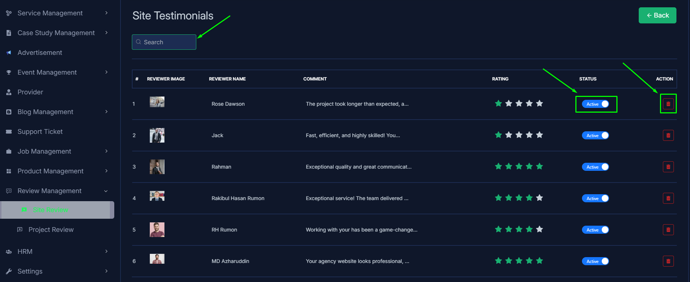
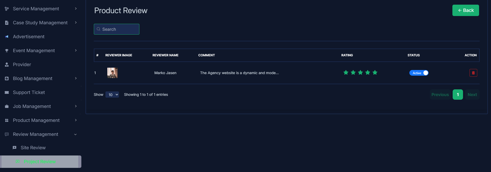

import React from 'react';
import Tabs from '@theme/Tabs';
import TabItem from '@theme/TabItem';

      <Tabs
        defaultValue="site review"
        values={[
          { label: 'Site Review', value: 'site review' },
          { label: 'Project Review', value: 'project review' },
        ]}
      >

<TabItem value="site review">

# Site Review

- In this section, the admin can view the complete list of site testimonial.
- Admin can search a specific category by using the **search bar**.
- Admin can delete the category by using the **Delete** button.
- Admin can off/on the category by using the **Status** switch. In which categories are on, users can see them in the category section. Otherwise not.

</TabItem>

<TabItem value="project review">

# Project Review

- In this section, the admin will be able to see all the total project review from the users.
- Admin can search a specific event by using the **search bar**.
- Admin can delete the event by using the **Delete** button.
- Admin can off/on the event by using the **Status** switch. In which events are on, users can see them in the event section. Otherwise not.

</TabItem>

</Tabs>