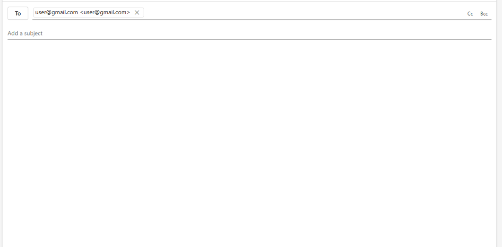
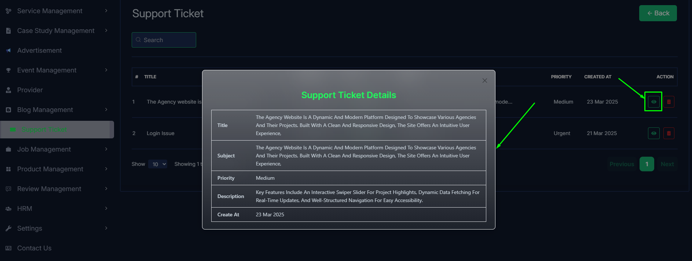

# Support Tickets

- In this section, the admin can view the complete list of support tickets.
- Admin can search a specific support ticket by using the **search bar**.
- Admin can delete the support ticket by using the **Delete** button.

- Admin can reply a support ticket by clicking the **Sent Mail** button.

- Admin can view the support ticket details by clicking the **View icon** button.
- A page will open where admin can view the support ticket details like name, email, subject, message.

