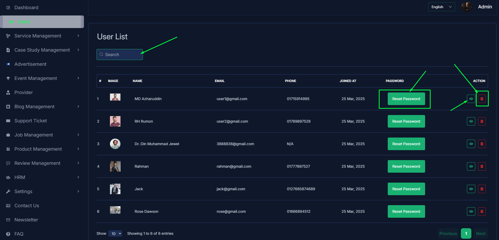
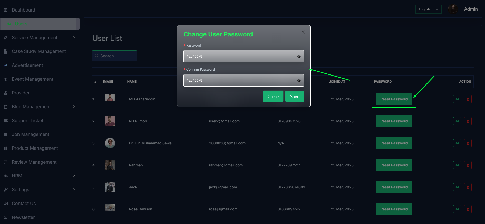

# Users

- In this section, admin can see all users.
- Admin can search a specific user by using the **search bar**.
- Admin can delete the user by using the **Delete** button.

- Admin can see the user details by clicking the **view** button.

- If any how user forget their password or cant reset the password, admin can reset the password by clicking the **Reset Password** button.
- A form will be displayed then fill all the required fields and click on the **Save** button to reset the password.

