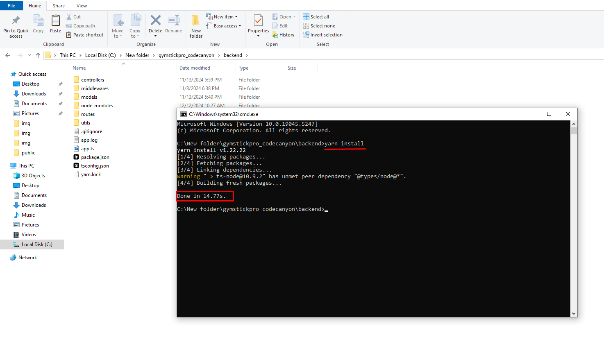

# Backend Installation

import Tabs from '@theme/Tabs';
import TabItem from '@theme/TabItem';

<Tabs defaultValue="local" values={[
  {label: 'Local Installation', value: 'local'},
  {label: 'Server /Aapanel Installation', value: 'server'},
]}>

<TabItem value="local">

# Local Backend Installation Process

## Step 1:
- First you need to navigate to the backend project folder, then open the terminal and run:
`yarn install`

!

## Step 2:
- Now, build the project by running the following command: `yarn build`

## Step 3:

- Finally, start the backend server locally with: `yarn dev`

Initially, it will show **Database connection failed** after you successfully set up your frontend, the .env file will be automatically created, and it will show **Database connection successfully**.

!

:::tip success
Now your backend is running locally. You can access it via localhost: `port` .
:::

!

:::tip success
Now you need to setup your frontend. click here to open frontend installation process Frontend Installation Process
:::

</TabItem>

<TabItem value="server">

# Backend Installation Process (Server / AaPanel)

## Step 1:

- Open the terminal. First, you need to deploy the backend to your domain or subdomain. We recommend using a subdomain, such as backend.your_main_domain.com. Zip the backend project files and upload them to your server.

!

## Step 2:

- Go to your servers file manager (AaPanel or similar)

image

## Step 3:

- Now upload the backend.zip file.

image

## Step 4:

- Unzip the uploaded file

image

## Step 5:
- Open the terminal in your server and run the following command : `sudo yarn`

image

## Step 6:

- Once the installation is complete, you should see the node_modules folder.

image

## Step 7:

- Next, find and click the Website button in your server panel's sidebar.

image

## Step 8:

- Click the Node Project button and then click the **Add Node Project** button.

image

## Step 9:

- Right-click on your file and select the options that appear.

- Click the indicated button to select your folder path, fill in the name (use underscores, no spaces), select the run options, port, and node version. Enter your domain name and click the confirm button to ensure everything is correct.

image

image

## Step 10:

- Click on the SSL button, select the two checkboxes, and apply the settings.

image

## Step 11:

- If SSL isn't applied automatically, click to force SSL from the settings menu.

:::tip success
Your backend is now live and ready to use. Please copy your subdomain URL to integrate with the frontend project, such as backend.your_main_domain.com.
:::

</TabItem>

</Tabs>