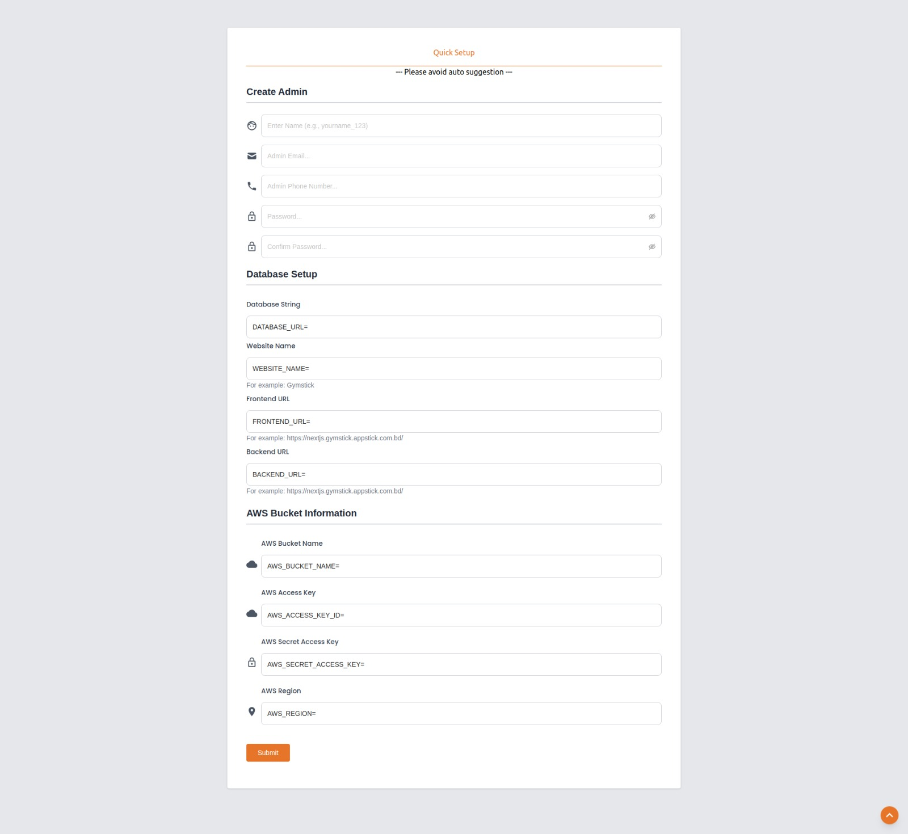

# Env setup

- Now hit your domain on browser like, your_main_domain.com first, the following page will be appeared. Now follow the below steps.

 

## Admin Creation
- In this section, the admin or company owner has to provide the basic information like username, email, phone number and password to activate the website.

 

## AWS Bucket Information
- Please fill out proper AWS bucket information. Click Here for proper instructions

 

## Server restart
- Go to your cPanel or server panel. Click your backend folder.

 

- Then click on the Restart button.

 

## Database Setup

- At first, you have to create a MongoDB Atlas account. Click here to create account.You can choose any plan, also you can choose free shared plan too.

 

- Make sure you have to select free shared and hit enter Create Clustor.

 

- Then you can see your personal MongoDB database dashboard.Click Build a Database button.

 

- Please fill in this information carefully. You need to follow these picture instructions.

 

- Now Click Network access. and Click ADD IP ADDRESS, then you can see a modal.

 

- Now you can see of your mondoDB account dashboard. You have to create Network Access. We recommend to put your server IP address to maintain the security. Also you can set it public access, which is not recommended.

 

- Now delete the previous IP address. Keep the new one.

 

- Then you need to go to the main dashboard of the database. And click on Connect.

 

- Now select connect your application.

 

- Now copy the link carefully .

 

- Right now, Your Database creation process is done. Just copy the URL from your mongoDB atlas account like the upper image. Now you have to paste the URL in Database String field. Also you have to put company website name like Gymstick.

 

:::tip My tip
 Then go to your website and reload this page. Then you can see your home page.
:::
