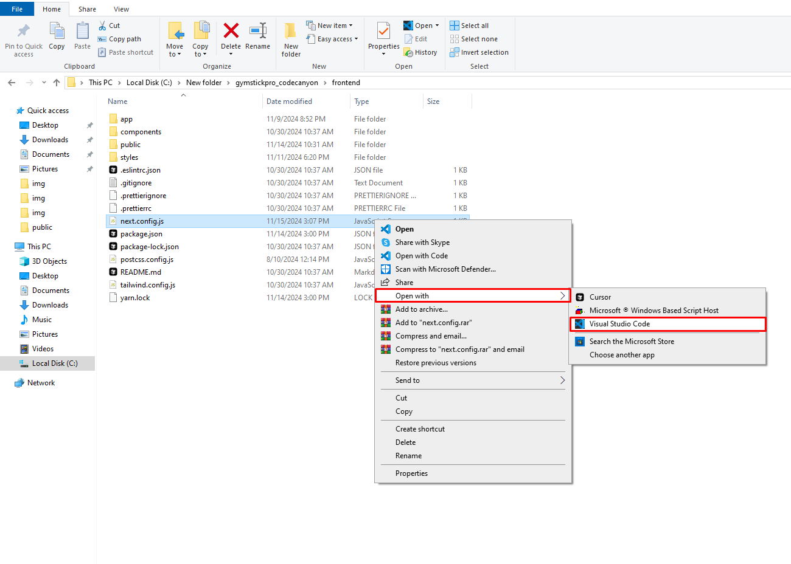
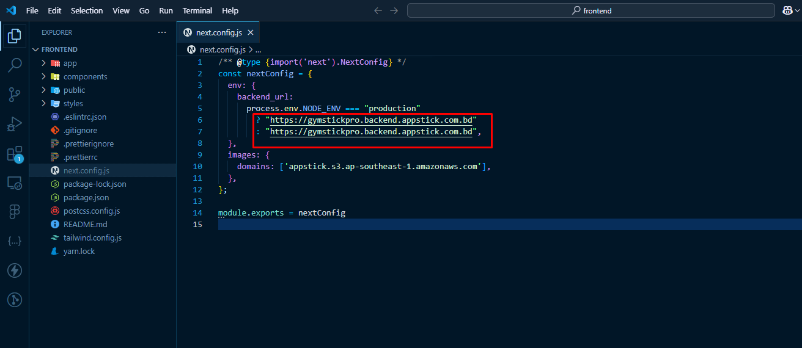
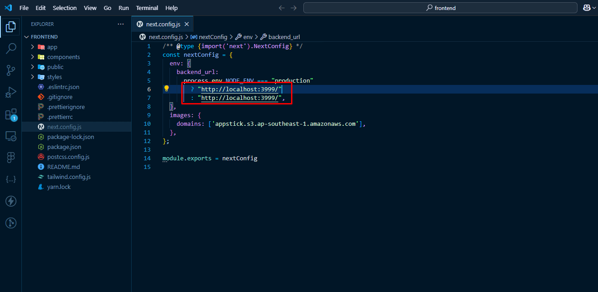
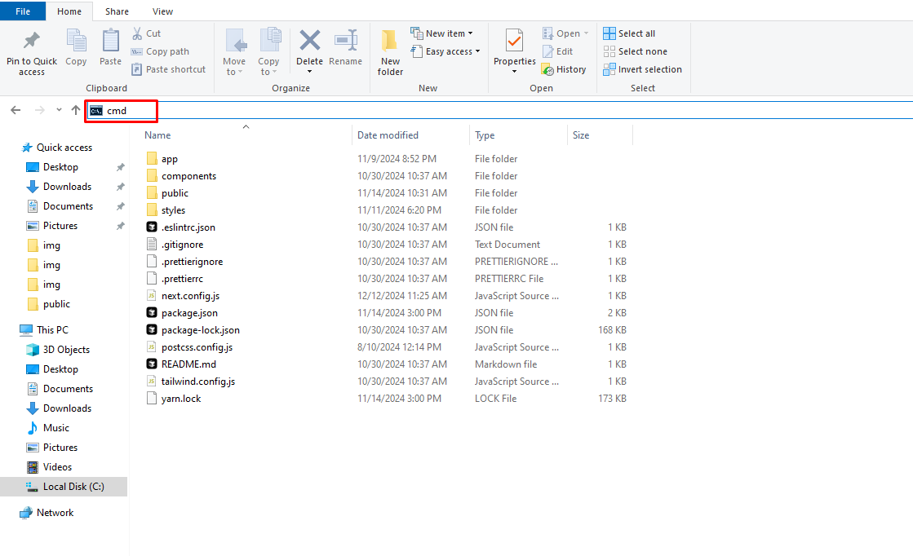
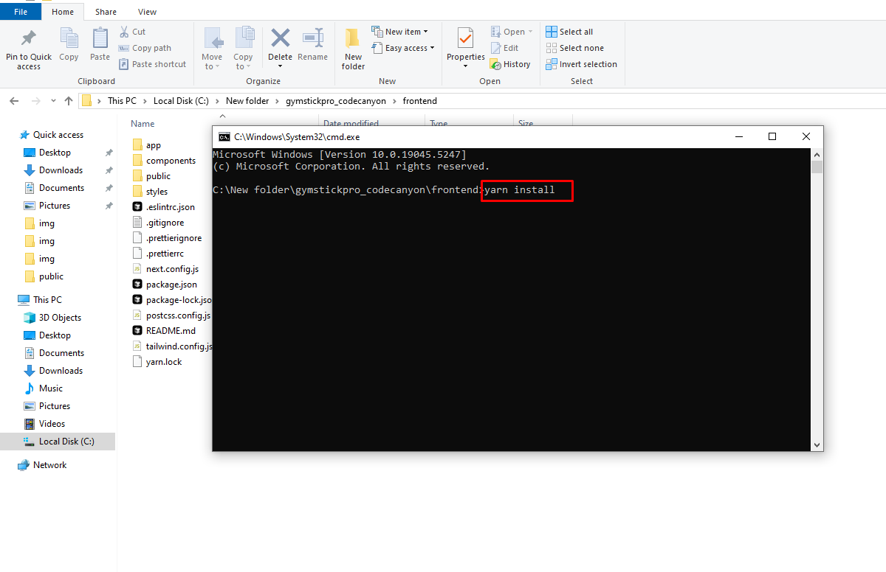
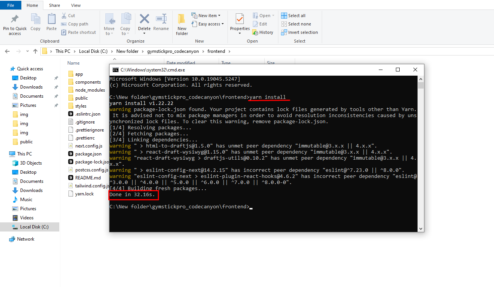
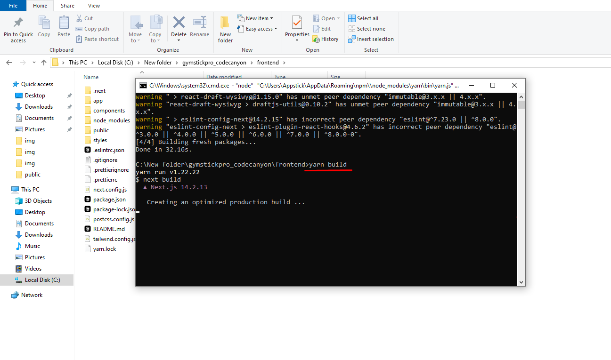
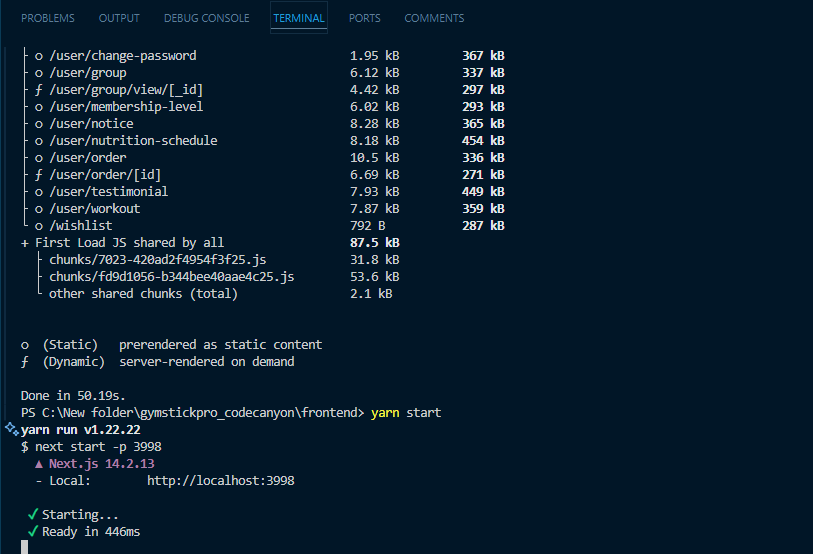
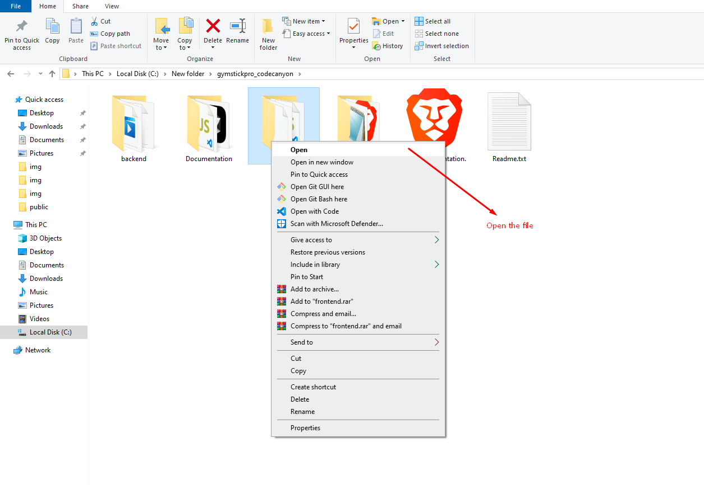

# Frontend Installation

import Tabs from '@theme/Tabs';
import TabItem from '@theme/TabItem';

<Tabs defaultValue="local" values={[
  {label: 'Local Setup', value: 'local'},
  {label: 'Server/Aapanel Deployment', value: 'server'},
]}>

<TabItem value="local">

## Frontend Local Installation Process

## Step 1: 

- Open the folder first.

## Step 2: 

- Find the next.config.js file and open it in your preferred text editor. `next.config.js example`

## Step 3: 

- Update the necessary information in your website configuration, such as the **BACKEND URL**. Ensure you provide your personal backend domain or subdomain URL, and update the images domain URL as well. If you want to connect locally, add the **local URL**.

- Local Backend URL Example: http://localhost:3999/

## Step 4: 

- Open your terminal or command prompt:
- For Mac and Linux users, use the terminal.
- For Windows users, open the address bar and type `cmd` to launch the Command Prompt.

## Step 5: 

- In the command prompt, run the following command: `yarn install` and hit enter.

## Step 6: 

- After the installation is complete, build the project by running: `yarn build` and press enter.

## Step 7: 

- Once the build is successful, you should see a confirmation message.

## Step 8: 

- Finally, you can run the project locally by typing: `yarn start` and hitting enter.

:::tip success

Now your Frontend is running locally. You can access it via localhost:port.

:::
</TabItem>

<TabItem value="server">

## Frontend Server/CPanel Deployment Process

## Step 1: 

- Zip the `out` folder and upload it to your server.

!

## Step 2: 

- Go to your server panel or cPanel, select your Document Root, and right-click on your mouse.

image

## Step 3: 

- Now follow the `backend installation` process from Step 2 to Step 10.

:::warning
**Note :**  In Step 7 of the backend installation process, in the domain name section, please confirm that it will be the root domain (Not a subdomain). For example, your_main_domain.com.

:::
## Step 4:
- After successfully completing all the processes, your website will go live. Visit your domain URL, for example, your_main_domain.com.
</TabItem>

</Tabs>