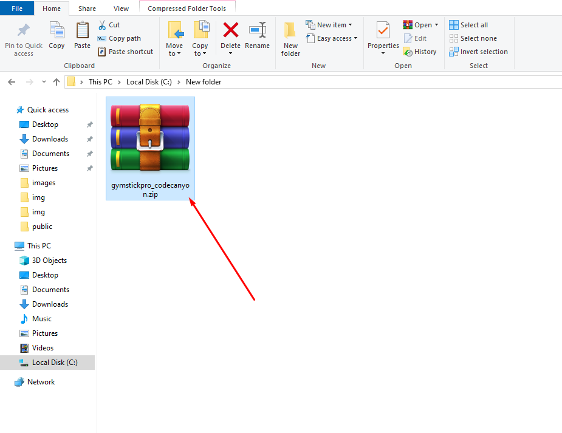
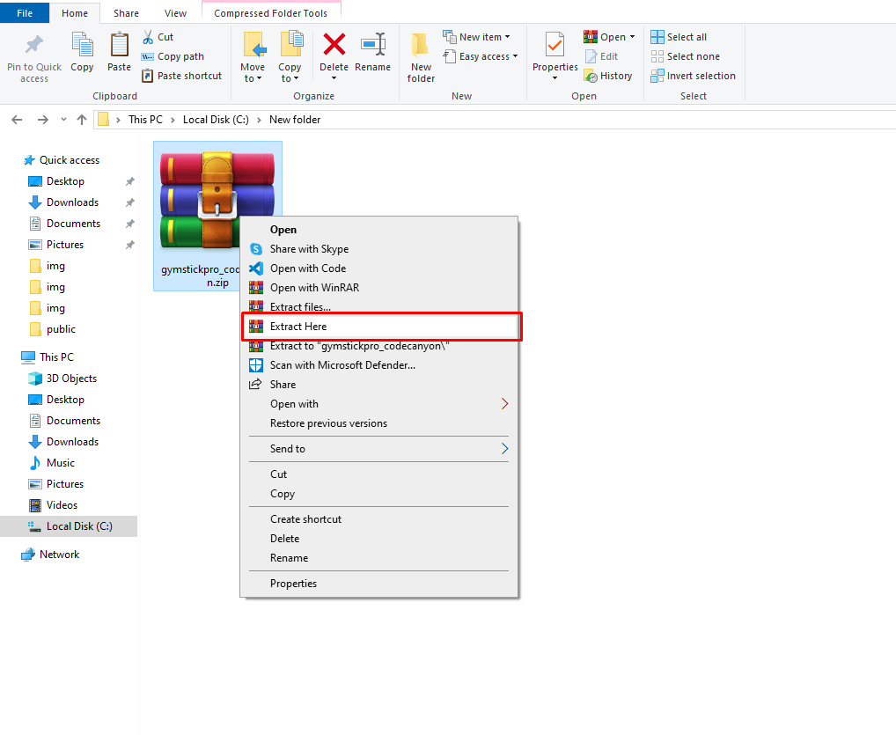
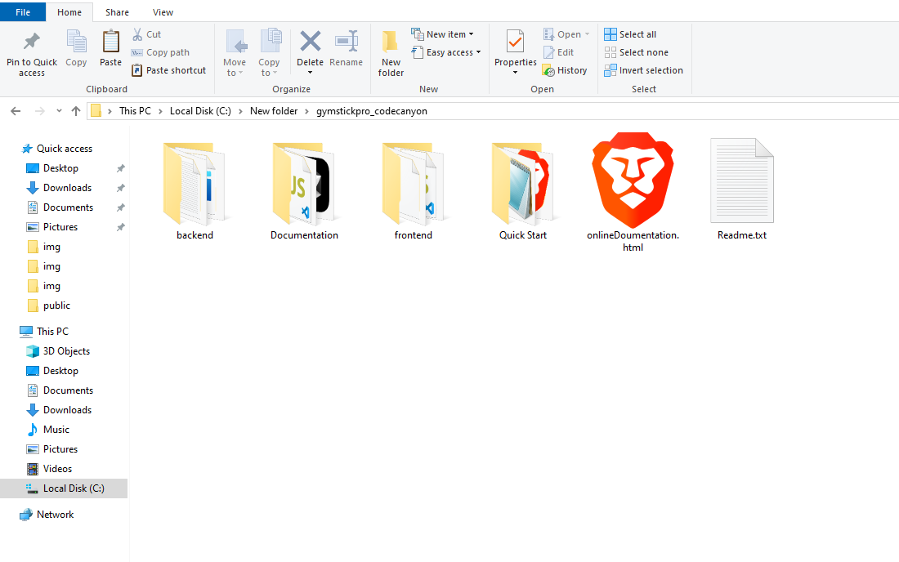

# Quick Start

## Installation Process

## System Requirements

:::warning
To setup this project, you need to make sure that your hosting server supports node.js
:::

- Node.js ( 20.x )
- npm or yarn

## Follow these steps to set up your project

- First, You have to download the file, you will get a zip file.
<!-- image -->

- Then, you have to Extract the file.

<!-- image -->

- You will find two files 1. `backend` and 2. `frontend`

<!-- image -->

## Install project dependencies

- If NodeJs is not installed, then follow this step to install NodeJs: **[Official Page](https://nodejs.org/en/)**

- After successfully installed, check NodeJs version. Open your command line interface and enter the following command:

  `node --version`

- If yarn is not installed, then use the following command to install yarn: `npm i -g yarn`

- Check yarn version, Open your command line interface and enter the following command: `yarn --version`
Now you need to follow the below instructions .

