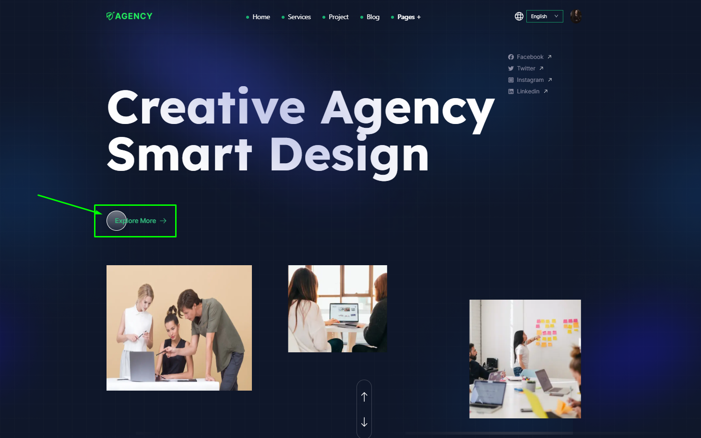
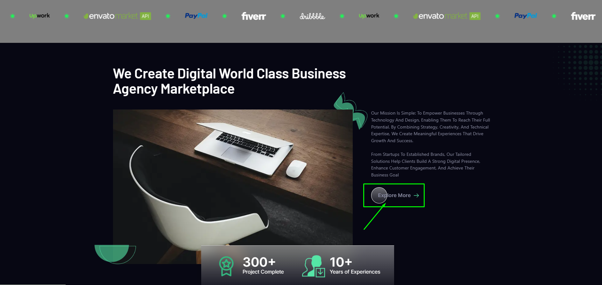
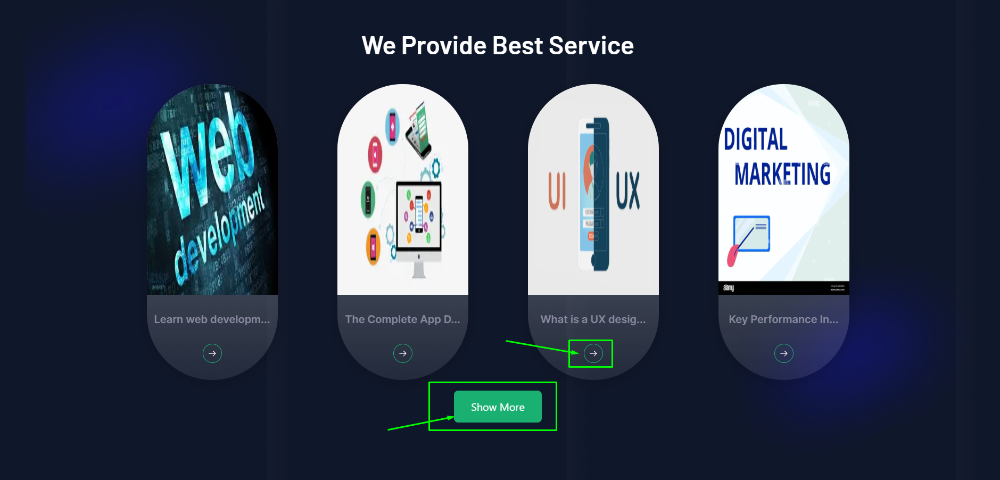
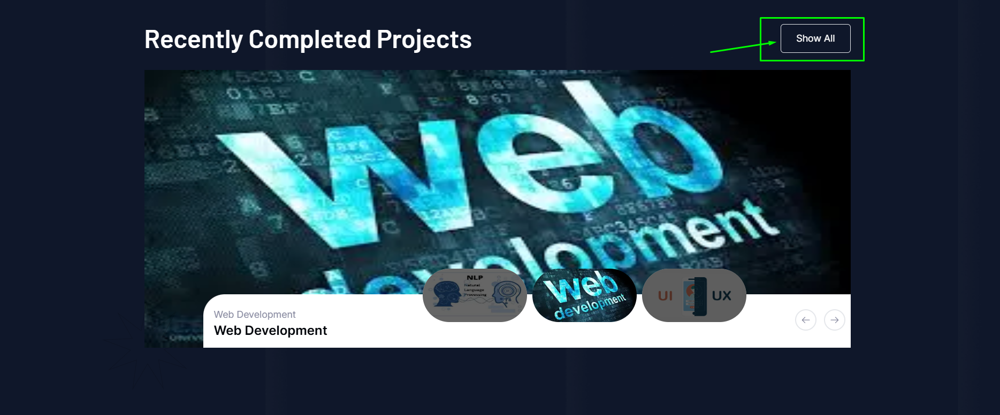
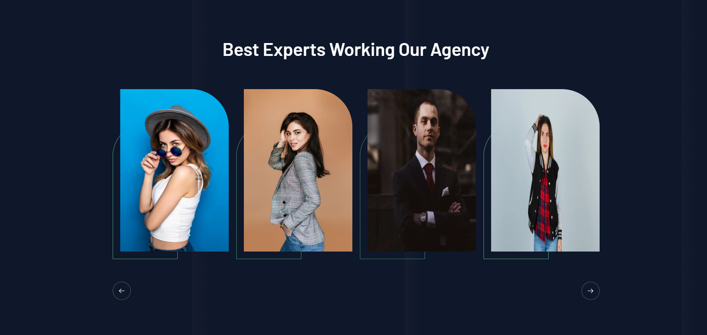
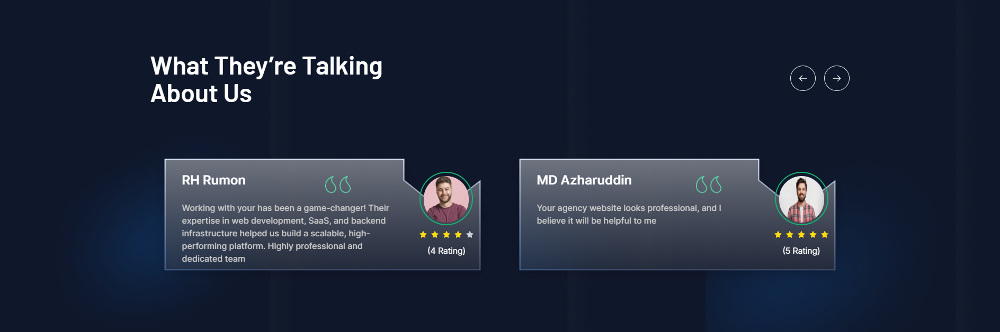
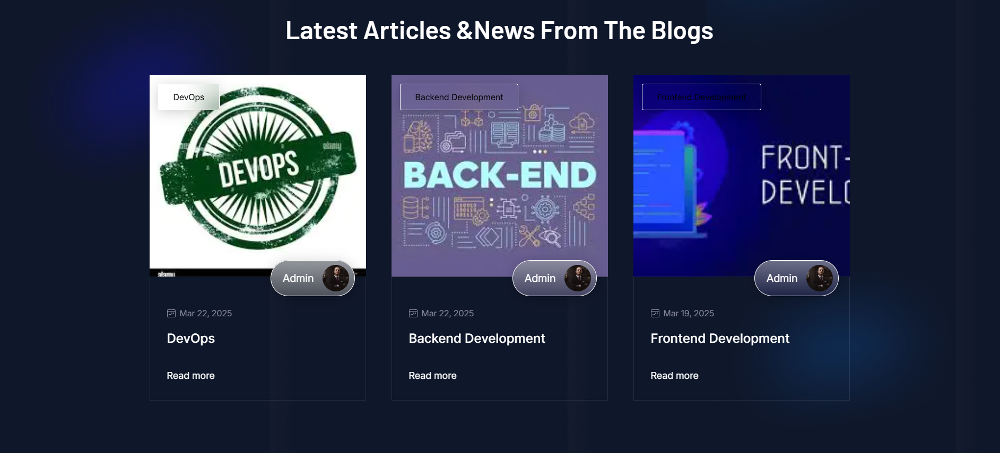

# Theme 3

## Hero Section
- In this section, users can see the hero section with video and content, here all the sections are dynamic.
- Admin can change it according to his requirement.
- To clicking the **Down Arrow** button it'll go the bottom of the page.
- To clicking the **Explore More** button to go to the about page and you can see the details about us.

## About Us
- In this section, users can see the about us section with photo and content, here all the sections are dynamic.
- Here you will see the logo of your clients or partners with whom you have worked untill now.
- To clicking the **Explore More** button to go to the about page and see the details about us.

## Services

- In this section, uses can see the services section photo and content, here all the sections are dynamic.
- To clicking the **Arrow icon** go to the Service detail page.
- To clicking the **All Service** button to go to the services page and see all services .

## Projects

- In this section, uses can see the projects section photo and content, here all the sections are dynamic.
- To clicking the **Left or Right Arrow** icon it'll go to the left or right side.
- To clicking the **All Project** button to go to the projects page and see all projects.

## Providers

- In this section, uses can see our all providers.
- To clicking the providers image to go to the provider details page.
- To clicking the **Left or Right Arrow** icon it'll go to the left or right side.

## Testimonial

- In this section, uses can see the testimonial.

## Blog
- In this section, uses can see all of the Blogs
- To clicking the **View More** button to go to the projects page and see all projects.
- Clicking the **Read More** button to go to the Blog details page.

