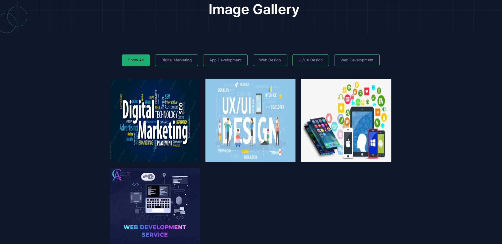
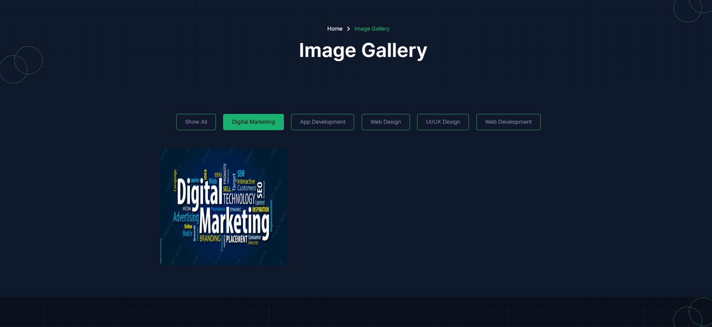
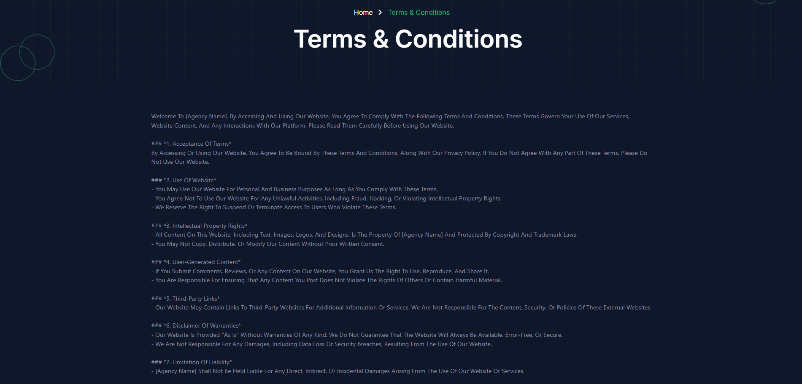
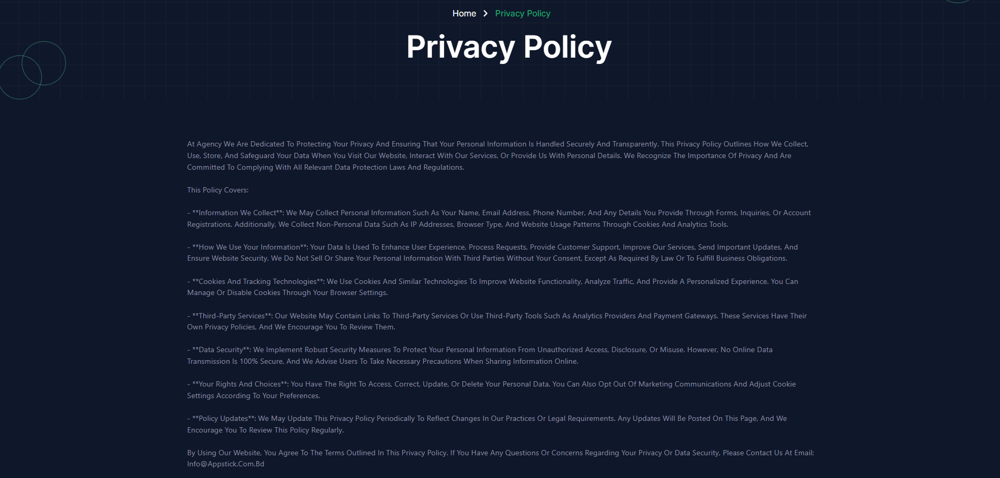
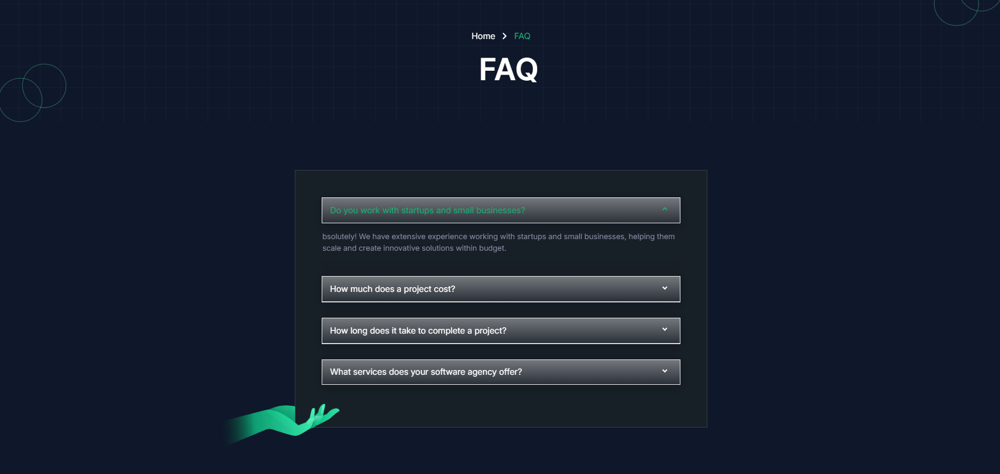
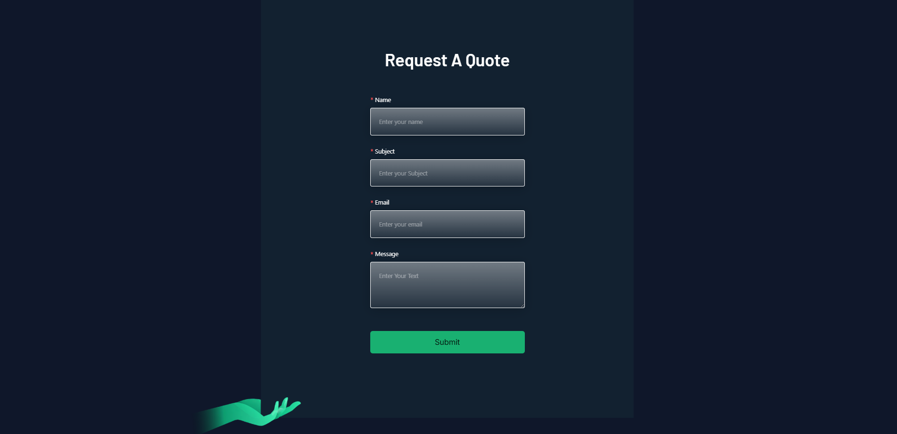

import React from 'react';
import Tabs from '@theme/Tabs';
import TabItem from '@theme/TabItem';

      <Tabs
        defaultValue="Inner pages"
        values={[
          { label: 'Inner pages', value: 'Inner pages' },
          { label: 'Video Gallery', value: 'Video Gallery' },
          { label: 'Photo Gallery', value: 'Photo Gallery' },
          { label: 'Terms & Conditions', value: 'Terms & Conditions' },
          { label: 'Privacy Policy', value: 'Privacy Policy' },
          { label: 'Faq', value: 'Faq' },
          { label: 'Quote', value: 'Quote' }
          
        ]}
      >

<TabItem value="Inner pages">

# Inner pages

- In this site users can view many kind of pages with dynamic content.
- There are video gallery, photo gallery, terms and conditions, privacy policy, faq, quote. 

</TabItem>

<TabItem value="Video Gallery">

# Video Gallery

- In this section, users can view lots of video content thats uploaded by admin.

- If users want to play this video then they can click the **Play** button of the video content.

</TabItem>

<TabItem value="Photo Gallery">

# Photo Gallery

- In this section, users can view lots of photo content thats uploaded by admin.

- If users want to see the specific category photos then they can click the category name. The image will be filtered according to the category.

</TabItem>

<TabItem value="Terms & Conditions">

# Terms & Conditions

- In this section, anyone can see the terms and conditions section, here all the sections are dynamic.

- Admin can change it according to his requirement.

</TabItem>

<TabItem value="Privacy Policy">

# Privacy & Policy

- In this section, anyone can see the privacy policy section, here all the sections are dynamic.

- Admin can change it according to his requirement.

</TabItem>

<TabItem value="Faq">

# Faq

- In this section, anyone can see the FAQ section, here all the sections are dynamic.

- Admin can change it according to his requirement. 

</TabItem>

<TabItem value="Quote">

# Quote

- In this section, anyone can see the QUOTE section.
- Users can contact the admin by filling the form in where admin want to know user's name, email, subject and message and must click the **Submit** button.

**.

</TabItem>

</Tabs>