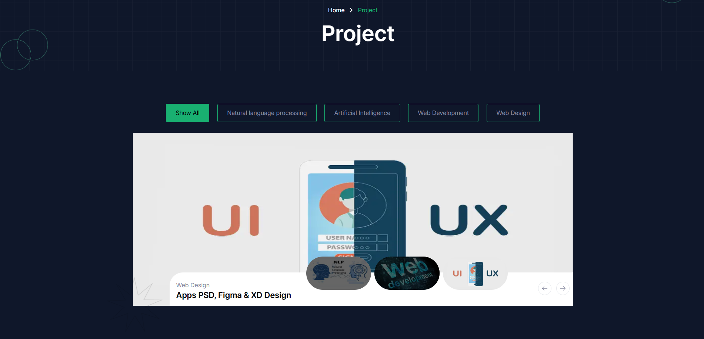

# Projects

- In this section, uses can see our all projects.
- Users can filter the projects according to project category.
- To clicking the project image to go to the project details page.

## How to see a project details?

- Users can see a project details by clicking the project image.
- Users can see the project description, category, project price and discount.
- If users want to buy this project then they can click the **Purchase Now** button.
- If Users has any query in this project then they can send a message to admin.
- For sending message users have to fill the form in where admin want to know user's name, email, subject and message and must click the **Send Message** button. 

- In this section, uses can see the project review of a project.
- Here only whom bought the project, they can review the project and rate it. otherwise they can't.

